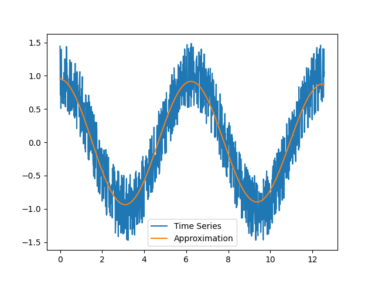

# Reverse Homogeneous Ordinary Differential Equation Solver

A numerical scheme which tried to approximate a time series by the solution from an homogeneous ODE with constant coefficients. Normally you would know the coefficients and use something like `scipy.integrate.solve_ivp` to get the corresponding time series, this code tries to do the reverse.

```python3
from rhodes import rhodes, pretty_format
import numpy as np

# Creating sample data
X = np.linspace(0, 4*np.pi, 1000)
Y = np.cos(X)
#
# Guessing the coefficients.
ode_order = 2
ode_coefficients, initial_conditions = rhodes(ode_order, X, Y)
#
# Printing raw results.
print("ode_coefficients ->", ode_coefficients)
print("initial_conditions ->", initial_conditions)
#
# Pretty printing of the ODE.
print(pretty_format(ode_order, ode_coefficients, initial_conditions)
```

On my machine this gives:
```
ode_coefficients -> [1.00000000e+00 2.20828831e-16 1.00002637e+00]
initial_conditions -> [-5.26140163e-16  1.00000000e+00]
1.0 x f'' + 2.2082883090712833e-16 x f' + 1.0000263722531788 x f ~= 0
f'(x0) = -5.2614016267904675e-16
f(x0) = 1.0000000000000016
```

Which is what we would expect for the `cosinus` function.

```python3
from rhodes import rhodes, pretty_format
import numpy as np

# Creating sample data
X = np.linspace(1, 10, 1000)
Y = np.exp(X)
#
# Guessing the coefficients.
ode_order = 10
ode_coefficients, initial_conditions = rhodes(ode_order, X, Y)
#
# Printing raw results.
print("ode_coefficients ->", ode_coefficients)
print("initial_conditions ->", initial_conditions)
#
# Pretty printing of the ODE.
print(pretty_format(ode_order, ode_coefficients, initial_conditions)
```

On my machine this gives:
```
ode_coefficients -> [ 1.         -0.2809392  -0.35599019 -0.19663648 -0.08792598 -0.04065109
 -0.01971844 -0.00959527 -0.00475749 -0.0025397  -0.00122994]
initial_conditions -> [2.71812084 2.71813921 2.71815766 2.71817608 2.71819445 2.71821274
 2.7182309  2.7182488  2.7182665  2.71828183]
1.0 x f'''''''''' + -0.28093920145701806 x f''''''''' + -0.35599018842891755 x f'''''''' + -0.19663648128025868 x f''''''' + -0.08792597733654167 x f'''''' + -0.040651089022720216 x f''''' + -0.019718444130134967 x f'''' + -0.009595274936651325 x f''' + -0.0047574874873987 x f'' + -0.002539703436636903 x f' + -0.0012299437251018172 x f ~= 0
f'''''''''(x0) = 2.7181208411141378
f''''''''(x0) = 2.718139207535012
f'''''''(x0) = 2.7181576560658605
f''''''(x0) = 2.7181760847791545
f'''''(x0) = 2.7181944515077126
f''''(x0) = 2.718212744962182
f'''(x0) = 2.7182309025818197
f''(x0) = 2.7182488043568362
f'(x0) = 2.718266503123621
f(x0) = 2.718281828456406
```

One last trial with a perturbated input:
```python3
from rhodes import rhodes, pretty_format
import numpy as np

# Creating sample data
X = np.linspace(0, 4*np.pi, 1000)
Y = np.cos(X) + np.random.random_sample(1000) - 0.5
#
# Guessing the coefficients.
ode_order = 2
ode_coefficients, initial_conditions = rhodes(ode_order, X, Y)
#
# Printing raw results.
print("ode_coefficients ->", ode_coefficients)
print("initial_conditions ->", initial_conditions)
#
# Pretty printing of the ODE.
print(pretty_format(ode_order, ode_coefficients, initial_conditions)
```

On my machine this gives:
```
ode_coefficients -> [1.         0.01379077 1.0043634 ]
initial_conditions -> [-0.04116298  0.95529709]
1.0 x f'' + 0.013790765289065303 x f' + 1.004363395891228 x f ~= 0
f'(x0) = -0.04116298217615213
f(x0) = 0.9552970858076686
```

